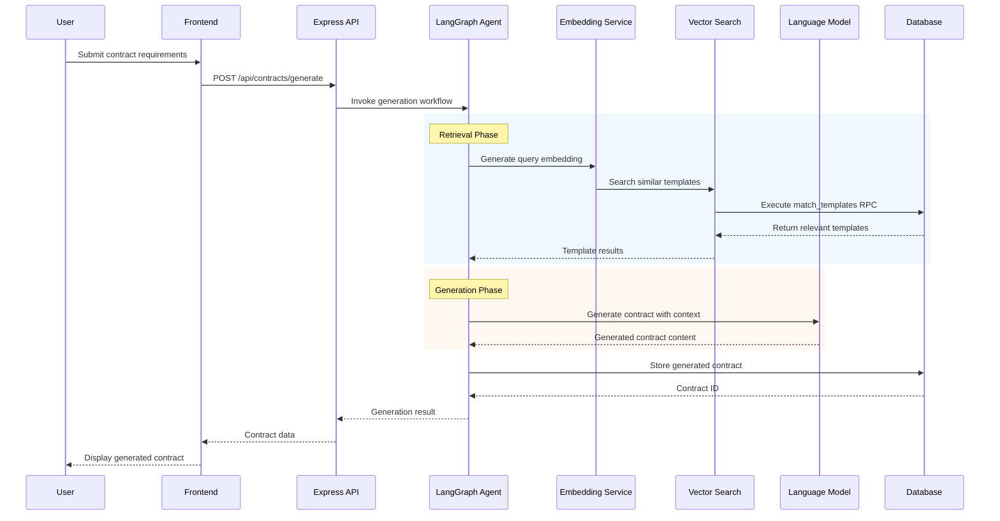
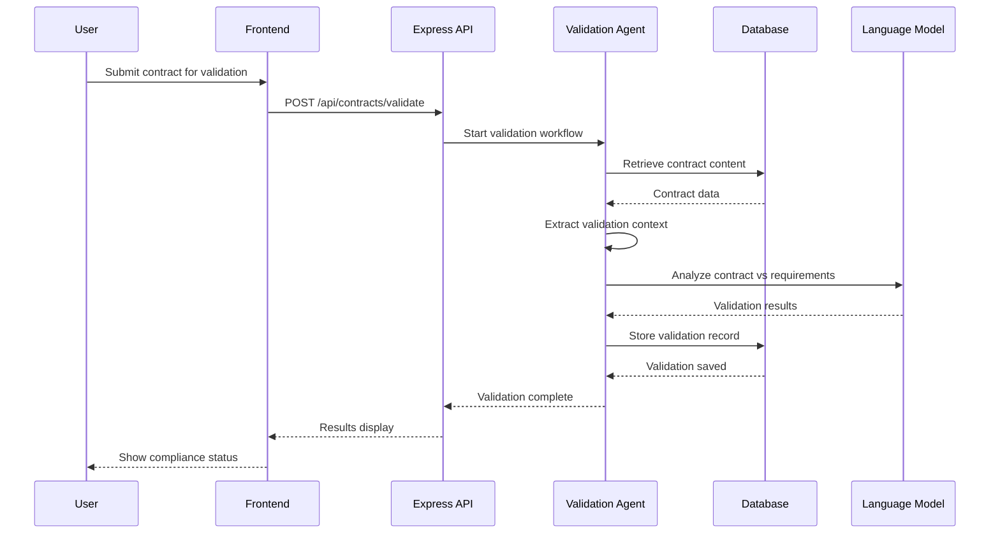
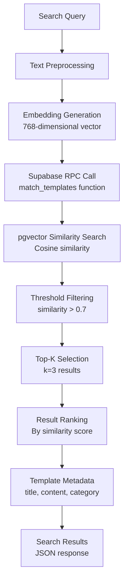
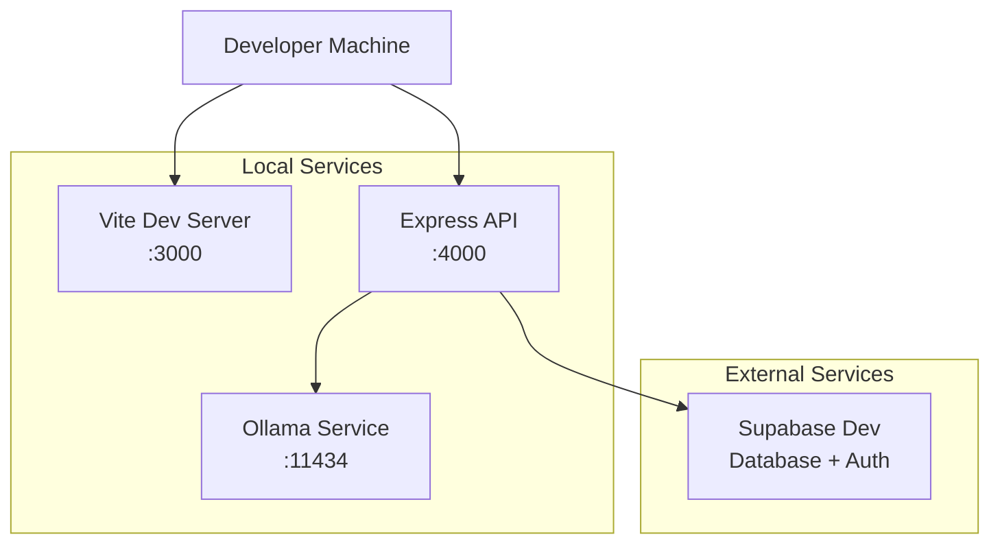
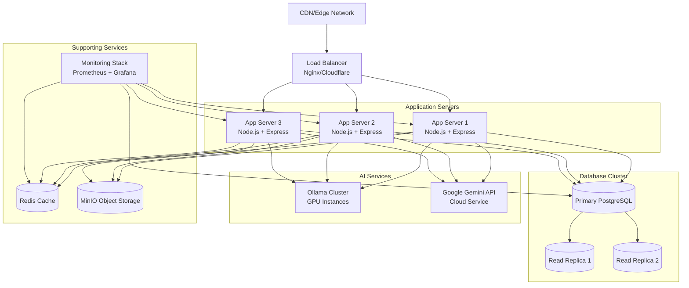

# ContractHub Architecture Diagram - Detailed

## System Overview

ContractHub is a comprehensive AI-powered contract management platform featuring document processing, intelligent contract generation, compliance validation, and semantic search capabilities.

## High-Level Architecture

```mermaid
graph TB
    %% User Interface Layer
    subgraph "Frontend Layer (React + Vite)"
        UI[React SPA<br/>TypeScript + Vite]
        subgraph "Core Pages"
            DASH[Dashboard<br/>Statistics & Overview]
            CONT[Contracts<br/>CRUD + Download]
            TEMPL[Templates<br/>Library Management]
            GEN[Contract Generator<br/>AI-Powered Creation]
            VAL[Contract Validator<br/>Compliance Checking]
        end
        subgraph "UI Components"
            SIDEBAR[Responsive Sidebar<br/>Navigation]
            FORMS[Dynamic Forms<br/>Zod Validation]
            TOAST[Toast Notifications<br/>User Feedback]
            THEME[Theme Provider<br/>Dark/Light Mode]
        end
        subgraph "State Management"
            RQ[TanStack Query<br/>Server State]
            HOOKS[Custom Hooks<br/>Business Logic]
        end
    end

    %% API Gateway Layer
    subgraph "API Gateway Layer (Express.js)"
        EXP[Express Server<br/>TypeScript + Middleware]
        subgraph "REST API Endpoints"
            CONT_GET[GET /api/contracts<br/>List contracts]
            CONT_POST[POST /api/contracts<br/>Create contract]
            CONT_ID[GET /api/contracts/:id<br/>Get single contract]
            TEMPL_GET[GET /api/templates<br/>List templates]
            TEMPL_POST[POST /api/templates<br/>Create template]
            TEMPL_UPLOAD[POST /api/templates/upload<br/>Upload template file]
            GEN_POST[POST /api/contracts/generate<br/>AI generation]
            VAL_POST[POST /api/contracts/validate<br/>Compliance check]
            LLM_GET[GET /api/settings/llm-provider<br/>LLM configuration]
        end
        subgraph "Security & Middleware"
            CORS[CORS Middleware<br/>Cross-origin handling]
            SESSION[Session Management<br/>express-session]
            MULTER[File Upload<br/>10MB limit, PDF/DOCX/TXT]
            VALIDATION[Request Validation<br/>Zod schemas]
            ERROR[Error Handling<br/>Centralized middleware]
        end
    end

    %% Business Logic Layer
    subgraph "Business Logic Layer"
        ROUTES[Route Controllers<br/>Request handling]
        subgraph "Core Services"
            STORAGE[Storage Abstraction<br/>Supabase + In-memory]
            AI_AGENT[LangGraph Agent<br/>Workflow orchestration]
            FILE_PARSER[Document Parser<br/>Multi-format support]
            EMBEDDING[Embedding Service<br/>Vector generation]
        end
        subgraph "Workflow Engines"
            GEN_WORKFLOW[Contract Generation<br/>LangGraph State Machine]
            VAL_WORKFLOW[Validation Engine<br/>Compliance checking]
            SEARCH_ENGINE[Semantic Search<br/>Vector similarity]
        end
    end

    %% Data Persistence Layer
    subgraph "Data Persistence Layer"
        subgraph "Supabase (Primary Storage)"
            PG[(PostgreSQL 16<br/>ACID compliant)]
            VEC[(pgvector<br/>Vector embeddings)]
            subgraph "Core Tables"
                CONTRACTS[contracts<br/>id, title, content,<br/>type, status, parties,<br/>created_at, updated_at]
                TEMPLATES[templates<br/>id, title, content,<br/>category, usage_count,<br/>embedding, created_at]
                VALIDATIONS[validations<br/>id, contract_id,<br/>proposal_text, result,<br/>status, created_at]
                FUNC[Database Functions<br/>match_templates,<br/>increment_usage]
            end
        end
        subgraph "Fallback Storage"
            MEM_CACHE[In-Memory Cache<br/>Development mode<br/>Map-based storage]
        end
    end

    %% AI/ML Processing Layer
    subgraph "AI/ML Processing Layer"
        LANG_CORE[LangChain Core<br/>Runnables & Chains]
        subgraph "LangGraph Workflows"
            GEN_GRAPH[Generation Graph<br/>retrieve → generate → store]
            VAL_GRAPH[Validation Graph<br/>retrieve → analyze → validate]
        end
        subgraph "LLM Providers (Configurable)"
            OLLAMA[Ollama Provider<br/>Local inference<br/>http://localhost:11434]
            GEMINI[Gemini Provider<br/>Google AI API<br/>Cloud inference]
        end
        subgraph "Model Configurations"
            LLM_MODELS[Language Models<br/>llama3.1:8b (Ollama)<br/>gemini-pro (Gemini)]
            EMB_MODELS[Embedding Models<br/>nomic-embed-text (Ollama)<br/>embedding-001 (Gemini)]
        end
        subgraph "Vector Operations"
            EMB_GEN[Embedding Generation<br/>Text → Vector (768d)]
            COSINE_SIM[Cosine Similarity<br/>Vector search]
            SEMANTIC_SEARCH[Semantic Retrieval<br/>Top-k results]
        end
    end

    %% Document Processing Pipeline
    subgraph "Document Processing Pipeline"
        UPLOAD_HANDLER[Upload Handler<br/>Multer middleware]
        subgraph "Format Parsers"
            PDF_PARSER[pdfjs-dist<br/>PDF text extraction<br/>Font handling]
            DOCX_PARSER[mammoth.js<br/>DOCX conversion<br/>Style preservation]
            TXT_PARSER[Text Processor<br/>Direct handling<br/>UTF-8 encoding]
        end
        subgraph "Content Processing"
            TEXT_EXTRACT[Text Extraction<br/>Page-by-page processing]
            CLEANUP[Content Cleanup<br/>Formatting normalization]
            CHUNKING[Text Chunking<br/>800 chars, 200 overlap]
        end
    end

    %% External Dependencies
    subgraph "External Dependencies"
        SUPABASE[Supabase Platform<br/>Managed PostgreSQL<br/>Real-time subscriptions]
        OLLAMA_SERVICE[Ollama Runtime<br/>Local LLM server<br/>Model management]
        GEMINI_API[Google AI API<br/>Cloud AI services<br/>Rate limiting]
        PDFJS_CDN[pdfjs-dist CDN<br/>Font assets<br/>Standard fonts]
    end

    %% Configuration Management
    subgraph "Configuration Management"
        ENV_VARS[.env Configuration<br/>LLM_PROVIDER, API keys,<br/>Database URLs, ports]
        FEATURE_FLAGS[Feature Toggles<br/>AI provider switching,<br/>Debug modes]
        MODEL_CONFIG[Model Settings<br/>Temperature, chunk size,<br/>similarity thresholds]
    end

    %% Connections and Data Flow
    UI --> CONT_GET
    UI --> TEMPL_GET
    GEN --> GEN_POST
    VAL --> VAL_POST

    EXP --> ROUTES
    ROUTES --> STORAGE
    ROUTES --> AI_AGENT
    ROUTES --> FILE_PARSER

    STORAGE --> CONTRACTS
    STORAGE --> TEMPLATES
    STORAGE --> VALIDATIONS

    AI_AGENT --> GEN_WORKFLOW
    AI_AGENT --> VAL_WORKFLOW
    GEN_WORKFLOW --> LLM_MODELS
    VAL_WORKFLOW --> LLM_MODELS

    GEN_WORKFLOW --> SEARCH_ENGINE
    SEARCH_ENGINE --> EMBEDDINGS
    SEARCH_ENGINE --> COSINE_SIM

    FILE_PARSER --> UPLOAD_HANDLER
    UPLOAD_HANDLER --> PDF_PARSER
    UPLOAD_HANDLER --> DOCX_PARSER
    UPLOAD_HANDLER --> TXT_PARSER

    PDF_PARSER --> TEXT_EXTRACT
    DOCX_PARSER --> TEXT_EXTRACT
    TXT_PARSER --> TEXT_EXTRACT

    TEXT_EXTRACT --> EMB_GEN
    EMB_GEN --> EMBEDDINGS

    OLLAMA --> OLLAMA_SERVICE
    GEMINI --> GEMINI_API

    %% Styling
    classDef frontend fill:#e1f5fe,stroke:#01579b,stroke-width:2px
    classDef backend fill:#f3e5f5,stroke:#4a148c,stroke-width:2px
    classDef data fill:#e8f5e8,stroke:#1b5e20,stroke-width:2px
    classDef ai fill:#fff3e0,stroke:#e65100,stroke-width:2px
    classDef external fill:#fce4ec,stroke:#880e4f,stroke-width:2px
    classDef config fill:#f3e5f5,stroke:#6a1b9a,stroke-width:2px

    class UI,DASH,CONT,TEMPL,GEN,VAL,SIDEBAR,FORMS,TOAST,THEME,RQ,HOOKS frontend
    class EXP,CONT_GET,CONT_POST,CONT_ID,TEMPL_GET,TEMPL_POST,TEMPL_UPLOAD,GEN_POST,VAL_POST,LLM_GET,CORS,SESSION,MULTER,VALIDATION,ERROR backend
    class PG,VEC,CONTRACTS,TEMPLATES,VALIDATIONS,FUNC,MEM_CACHE data
    class LANG_CORE,GEN_GRAPH,VAL_GRAPH,OLLAMA,GEMINI,LLM_MODELS,EMB_MODELS,EMB_GEN,COSINE_SIM,SEMANTIC_SEARCH ai
    class SUPABASE,OLLAMA_SERVICE,GEMINI_API,PDFJS_CDN external
    class ENV_VARS,FEATURE_FLAGS,MODEL_CONFIG,UPLOAD_HANDLER,PDF_PARSER,DOCX_PARSER,TXT_PARSER,TEXT_EXTRACT,CLEANUP,CHUNKING,ROUTES,STORAGE,AI_AGENT,FILE_PARSER,EMBEDDING,GEN_WORKFLOW,VAL_WORKFLOW,SEARCH_ENGINE config
```

## Detailed Component Specifications

### 1. Frontend Layer (React + TypeScript)

#### Core Framework Stack
- **React 18.3.1**: Component-based UI with hooks and concurrent features
- **Vite 5.4.20**: Fast build tool with HMR and optimized production builds
- **TypeScript 5.6.3**: Static type checking and enhanced IDE support
- **Wouter 3.3.5**: Lightweight client-side routing (~1.5KB gzipped)

#### State Management
- **TanStack Query 5.60.5**: Server state management with caching, background updates, and optimistic updates
- **React Query DevTools**: Development debugging tools
- **Custom Hooks**: Business logic encapsulation and reusability

#### UI Component Library
- **Radix UI**: Unstyled, accessible component primitives
- **Tailwind CSS 3.4.17**: Utility-first CSS framework with custom design system
- **Lucide React 0.453.0**: Beautiful icon library (MIT licensed)
- **Framer Motion 11.13.1**: Animation library for smooth transitions
- **Tailwind Animate**: CSS animation utilities

#### Theme System
- **next-themes 0.4.6**: Theme switching with system preference detection
- **CSS Variables**: Dynamic theme color application
- **Dark/Light Mode**: Complete theme coverage across all components

#### Page Components
```typescript
// Main Pages Structure
- Dashboard (/): Statistics, recent contracts, system status
- Contracts (/contracts): CRUD operations, filtering, download
- Templates (/templates): Template management, upload, search
- Generate (/generate): AI contract creation wizard
- Validate (/validate): Contract compliance validation
- NotFound: 404 error page
```

### 2. Backend API Layer (Express.js + TypeScript)

#### Server Configuration
- **Express.js 4.21.2**: Web framework with middleware architecture
- **TypeScript**: Full type safety for API contracts
- **Port Configuration**: Default 4000 (configurable via PORT env var)
- **CORS**: Configured for cross-origin requests

#### Middleware Stack
```typescript
// Request Processing Pipeline
1. express.json() - JSON body parsing with 10MB limit
2. express.urlencoded() - URL-encoded data parsing
3. express-session - Session management with connect-pg-simple
4. passport.initialize() - Authentication middleware
5. passport.session() - Session-based auth persistence
6. cors() - Cross-origin resource sharing
7. Custom logging middleware - Request/response logging
8. Error handling middleware - Centralized error responses
```

#### API Endpoints Specification

##### Contract Management
```typescript
GET    /api/contracts           // List all contracts with pagination/filtering
GET    /api/contracts/:id       // Get specific contract by ID
POST   /api/contracts           // Create new contract
PUT    /api/contracts/:id       // Update existing contract (future)
DELETE /api/contracts/:id       // Delete contract (future)
```

##### Template Management
```typescript
GET    /api/templates           // List all templates with usage stats
GET    /api/templates/:id       // Get specific template by ID
POST   /api/templates           // Create template from text
POST   /api/templates/upload    // Upload and parse document file
```

##### AI Operations
```typescript
POST   /api/contracts/generate  // AI-powered contract generation
POST   /api/contracts/validate  // Contract compliance validation
```

##### System Configuration
```typescript
GET    /api/settings/llm-provider // Current LLM provider settings
```

#### Request/Response Schemas

**Contract Generation Request:**
```typescript
{
  proposal: string;        // User requirements/proposal text
  contractTitle: string;   // Desired contract title
  contractType: string;    // Type: NDA, employment, service, etc.
  parties?: string[];      // Involved parties (optional)
}
```

**Contract Validation Request:**
```typescript
{
  contractId: string;      // ID of contract to validate
  proposalText: string;    // Original requirements to validate against
}
```

### 3. Data Layer Architecture

#### Database Schema (Supabase PostgreSQL)

**Contracts Table:**
```sql
CREATE TABLE contracts (
  id VARCHAR PRIMARY KEY DEFAULT gen_random_uuid(),
  title TEXT NOT NULL,
  content TEXT NOT NULL,
  contract_type TEXT NOT NULL,
  status TEXT NOT NULL DEFAULT 'draft'
    CHECK (status IN ('draft', 'active', 'pending', 'validated', 'archived')),
  parties TEXT[] NULL,
  metadata JSONB NULL,
  created_at TIMESTAMP DEFAULT NOW(),
  updated_at TIMESTAMP DEFAULT NOW()
);
```

**Templates Table:**
```sql
CREATE TABLE templates (
  id VARCHAR PRIMARY KEY DEFAULT gen_random_uuid(),
  title TEXT NOT NULL,
  content TEXT NOT NULL,
  category TEXT NOT NULL
    CHECK (category IN ('nda', 'employment', 'service_agreement', 'partnership', 'lease', 'other')),
  description TEXT NULL,
  usage_count INTEGER NOT NULL DEFAULT 0,
  embedding VECTOR(768) NULL,  -- pgvector extension
  created_at TIMESTAMP DEFAULT NOW()
);
```

**Validations Table:**
```sql
CREATE TABLE validations (
  id VARCHAR PRIMARY KEY DEFAULT gen_random_uuid(),
  contract_id VARCHAR NOT NULL REFERENCES contracts(id),
  proposal_text TEXT NOT NULL,
  validation_result JSONB NOT NULL,
  status TEXT NOT NULL DEFAULT 'pending'
    CHECK (status IN ('pending', 'compliant', 'issues_found', 'failed')),
  created_at TIMESTAMP DEFAULT NOW()
);
```

#### Database Functions

**Template Matching (Vector Search):**
```sql
CREATE OR REPLACE FUNCTION match_templates(
  query_embedding VECTOR(768),
  match_threshold FLOAT DEFAULT 0.7,
  match_count INT DEFAULT 3
)
RETURNS TABLE(
  id VARCHAR,
  title TEXT,
  content TEXT,
  category TEXT,
  description TEXT,
  similarity FLOAT
)
LANGUAGE plpgsql
AS $$
BEGIN
  RETURN QUERY
  SELECT
    t.id,
    t.title,
    t.content,
    t.category,
    t.description,
    1 - (t.embedding <=> query_embedding) AS similarity
  FROM templates t
  WHERE 1 - (t.embedding <=> query_embedding) > match_threshold
  ORDER BY t.embedding <=> query_embedding
  LIMIT match_count;
END;
$$;
```

**Usage Tracking:**
```sql
CREATE OR REPLACE FUNCTION increment_template_usage(template_id_param VARCHAR)
RETURNS VOID
LANGUAGE plpgsql
AS $$
BEGIN
  UPDATE templates
  SET usage_count = usage_count + 1
  WHERE id = template_id_param;
END;
$$;
```

### 4. AI/ML Processing Layer

#### LangGraph Workflow Architecture

**Contract Generation Workflow:**
```typescript
// State Machine Definition
const ContractGenerationState = Annotation.Root({
  proposal: Annotation<string>(),
  contractTitle: Annotation<string>(),
  contractType: Annotation<string>(),
  parties: Annotation<string[]>(),
  templateContent: Annotation<string>(),
  templateId: Annotation<string | null>(),
  relevantTemplates: Annotation<any[]>(),
  generatedContent: Annotation<string>(),
  contractId: Annotation<string | null>(),
  useRag: Annotation<boolean>(),
  step: Annotation<string>(),
  error: Annotation<string | null>(),
});

// Workflow Nodes
1. retrieve_templates: Semantic search for relevant templates
2. generate_contract: LLM contract generation
3. store_contract: Save generated contract to database
4. error_handler: Handle workflow errors
```

**Validation Workflow:**
```typescript
const ValidationState = Annotation.Root({
  contractId: Annotation<string>(),
  proposalText: Annotation<string>(),
  contractContent: Annotation<string>(),
  relevantContext: Annotation<any[]>(),
  useRag: Annotation<boolean>(),
  validationResult: Annotation<any>(),
  step: Annotation<string>(),
  error: Annotation<string | null>(),
});
```

#### LLM Provider Configuration

**Ollama Configuration:**
```typescript
const ollamaConfig = {
  baseUrl: process.env.OLLAMA_BASE_URL || "http://localhost:11434",
  models: {
    llm: process.env.OLLAMA_MODEL || "llama3.1:8b",
    embedding: process.env.OLLAMA_EMBEDDING_MODEL || "nomic-embed-text"
  },
  parameters: {
    temperature: 0.7,
    top_p: 0.9,
    max_tokens: 4096
  }
};
```

**Gemini Configuration:**
```typescript
const geminiConfig = {
  apiKey: process.env.GEMINI_API_KEY,
  models: {
    llm: "gemini-pro",
    embedding: "embedding-001"
  },
  parameters: {
    temperature: 0.7,
    topK: 40,
    topP: 0.95,
    maxOutputTokens: 4096
  }
};
```

### 5. File Processing Pipeline

#### Document Parsing Architecture

```typescript
interface ParseResult {
  content: string;      // Extracted text content
  error?: string;       // Error message if parsing failed
  metadata?: {          // Additional file metadata
    pages?: number;
    encoding?: string;
    language?: string;
  };
}
```

**PDF Processing:**
```typescript
// pdfjs-dist configuration
const pdfConfig = {
  useSystemFonts: true,
  standardFontDataUrl: "https://cdn.jsdelivr.net/npm/pdfjs-dist@3.11.174/standard_fonts/",
  disableFontFace: false,
  isEvalSupported: false
};

// Text extraction process
1. Load PDF document from buffer
2. Iterate through each page
3. Extract text content using getTextContent()
4. Concatenate page content with page breaks
5. Return cleaned text
```

**DOCX Processing:**
```typescript
// mammoth.js configuration
const docxConfig = {
  styleMap: [
    "p[style-name='Heading 1'] => h1",
    "p[style-name='Heading 2'] => h2"
  ],
  includeDefaultStyleMap: false
};

// Conversion process
1. Convert DOCX buffer to mammoth result
2. Extract plain text content
3. Preserve basic formatting (paragraphs, lists)
4. Return formatted text
```

### 6. Configuration Management

#### Environment Variables
```bash
# Server Configuration
PORT=4000
NODE_ENV=development
API_VERSION=v1

# Database
DATABASE_PATH=./data/contract_hub.db

# LLM Provider Selection
LLM_PROVIDER=ollama  # or "gemini"

# Ollama Configuration
OLLAMA_BASE_URL=http://localhost:11434
OLLAMA_MODEL=llama3.1:8b
OLLAMA_EMBEDDING_MODEL=nomic-embed-text

# Supabase Configuration
SUPABASE_URL=https://your-project.supabase.co
SUPABASE_KEY=your-anon-key

# Google Gemini
GEMINI_API_KEY=your-gemini-api-key

# Security
JWT_SECRET=your-jwt-secret
BCRYPT_ROUNDS=10

# File Upload
MAX_FILE_SIZE=10485760  # 10MB
UPLOAD_PATH=./data/uploads

# RAG Configuration
CHUNK_SIZE=800
CHUNK_OVERLAP=200
TOP_K_RETRIEVAL=5
SIMILARITY_THRESHOLD=0.7

# Validation
VALIDATION_CONFIDENCE_THRESHOLD=0.8
PRICE_TOLERANCE_PERCENT=5
```

#### Feature Flags
```typescript
const featureFlags = {
  enableRag: true,              // Enable RAG for contract generation
  enableValidation: true,       // Enable contract validation
  enableTemplates: true,        // Enable template management
  enableFileUpload: true,       // Enable file upload functionality
  debugMode: process.env.NODE_ENV === 'development'
};
```

## Detailed Data Flow Diagrams

### 1. Contract Generation Workflow


### 2. Template Upload & Processing
```mermaid
sequenceDiagram
    participant U as User
    participant FE as Frontend
    participant MUL as Multer
    participant PAR as File Parser
    participant EMB as Embedding Service
    participant DB as Database

    U->>FE: Upload document file
    FE->>MUL: POST /api/templates/upload
    MUL->>MUL: Validate file (PDF/DOCX/TXT, 10MB)

    alt File Type: PDF
        MUL->>PAR: pdfjs-dist processing
        PAR->>PAR: Extract text from pages
    else File Type: DOCX
        MUL->>PAR: mammoth.js processing
        PAR->>PAR: Convert to plain text
    else File Type: TXT
        MUL->>PAR: Direct text processing
    end

    PAR->>EMB: Generate embeddings
    EMB->>DB: Store template + embedding
    DB-->>MUL: Template created
    MUL-->>FE: Success response
    FE-->>U: Template added to library
```

### 3. Contract Validation Pipeline


### 4. Vector Search Implementation


## Security Architecture

### Authentication & Authorization
```typescript
// Session-based authentication
const sessionConfig = {
  store: new connectPgSimple({
    conObject: dbConfig,
    tableName: 'user_sessions'
  }),
  secret: process.env.JWT_SECRET,
  resave: false,
  saveUninitialized: false,
  cookie: {
    secure: process.env.NODE_ENV === 'production',
    httpOnly: true,
    maxAge: 7 * 24 * 60 * 60 * 1000 // 7 days
  }
};
```

### Input Validation & Sanitization
- **Zod Schemas**: Runtime type validation for all API inputs
- **File Type Validation**: Strict MIME type checking for uploads
- **SQL Injection Prevention**: Parameterized queries via Drizzle ORM
- **XSS Protection**: React's automatic escaping and CSP headers

### Data Protection
- **Encryption**: TLS 1.3 for all external communications
- **API Keys**: Secure storage via environment variables
- **Session Security**: HttpOnly cookies with secure flags
- **CORS Policy**: Configured origins for production deployments

## Performance Optimizations

### Frontend Optimizations
```typescript
// React Query Configuration
const queryClient = new QueryClient({
  defaultOptions: {
    queries: {
      staleTime: 5 * 60 * 1000, // 5 minutes
      gcTime: 10 * 60 * 1000,   // 10 minutes
      retry: (failureCount, error) => {
        // Exponential backoff for network errors
        return failureCount < 3 && !isAuthError(error);
      }
    }
  }
});
```

### Database Optimizations
- **Indexing Strategy**:
  ```sql
  CREATE INDEX idx_contracts_status ON contracts(status);
  CREATE INDEX idx_contracts_created_at ON contracts(created_at DESC);
  CREATE INDEX idx_templates_category ON templates(category);
  CREATE INDEX idx_templates_usage ON templates(usage_count DESC);
  CREATE VECTOR INDEX idx_template_embeddings ON templates USING ivfflat (embedding vector_cosine_ops);
  ```
- **Connection Pooling**: Supabase managed connection pools
- **Query Optimization**: Efficient vector similarity searches

### AI/ML Performance
- **Model Caching**: Ollama model caching for faster inference
- **Batch Processing**: Embedding generation in batches
- **Rate Limiting**: API rate limiting for external services
- **Timeout Handling**: Request timeouts to prevent hanging

## Error Handling & Monitoring

### Error Types & Handling
```typescript
// Centralized error handling middleware
app.use((err: any, req: Request, res: Response, next: NextFunction) => {
  const status = err.status || err.statusCode || 500;
  const message = err.message || "Internal Server Error";

  // Log error details
  logger.error({
    message: err.message,
    stack: err.stack,
    url: req.url,
    method: req.method,
    ip: req.ip,
    userAgent: req.get('User-Agent')
  });

  // Sanitize error for client
  res.status(status).json({
    error: status >= 500 ? "Internal Server Error" : message,
    ...(process.env.NODE_ENV === 'development' && { stack: err.stack })
  });
});
```

### Logging Strategy
- **Request Logging**: All API requests with response times
- **Error Logging**: Structured error logging with context
- **AI Operation Logging**: LLM calls, embedding generation, vector searches
- **Performance Monitoring**: Response times, memory usage, database query performance

## Deployment Architecture

### Development Environment


### Production Environment


### Container Configuration
```dockerfile
# Multi-stage Dockerfile for production
FROM node:20-alpine AS base
WORKDIR /app

FROM base AS deps
COPY package*.json ./
RUN npm ci --only=production

FROM base AS builder
COPY . .
RUN npm run build

FROM base AS runner
ENV NODE_ENV=production
COPY --from=deps /app/node_modules ./node_modules
COPY --from=builder /app/dist ./dist
COPY --from=builder /app/server ./server
COPY --from=builder /app/shared ./shared

EXPOSE 4000
CMD ["node", "dist/index.js"]
```

## Scalability Considerations

### Horizontal Scaling
- **Stateless Application**: Easy horizontal scaling of API servers
- **Database Read Replicas**: Offload read operations
- **CDN Integration**: Static asset delivery
- **Load Balancing**: Request distribution across instances

### Performance Bottlenecks
- **AI Inference**: GPU acceleration for local Ollama instances
- **Vector Search**: pgvector indexing optimizations
- **File Processing**: Asynchronous processing for large documents
- **Database Connections**: Connection pooling and query optimization

### Caching Strategy
```typescript
// Multi-level caching
1. Browser Cache: Static assets, API responses
2. Application Cache: Computed results, embeddings
3. Database Cache: Frequently accessed templates
4. CDN Cache: Global distribution of assets
```

## Future Enhancements

### Planned Features
- **Real-time Collaboration**: WebSocket integration for multi-user editing
- **Advanced Analytics**: Contract performance metrics and insights
- **Integration APIs**: Third-party service integrations
- **Mobile Application**: React Native mobile client
- **Multi-language Support**: Internationalization (i18n)

### Technical Debt & Improvements
- **Database Migration**: Complete migration from in-memory to persistent storage
- **API Documentation**: OpenAPI/Swagger documentation
- **Testing Coverage**: Comprehensive unit and integration tests
- **Performance Monitoring**: APM integration (DataDog, New Relic)
- **Security Audit**: Penetration testing and vulnerability assessment

## Key Technologies

- **Frontend**: React, TypeScript, Vite, Tailwind CSS, Radix UI
- **Backend**: Node.js, Express.js, TypeScript
- **Database**: PostgreSQL, Supabase, pgvector
- **AI/ML**: LangChain, LangGraph, Ollama, Google Gemini
- **File Processing**: pdfjs-dist, mammoth.js
- **Authentication**: Passport.js, express-session
- **Validation**: Zod schemas
- **Build Tools**: Vite, esbuild, TypeScript

## Deployment Architecture

```
┌─────────────────┐    ┌─────────────────┐
│   Client App    │    │   Express API   │
│    (Vite)       │◄──►│   (Node.js)     │
│                 │    │                 │
│ - React SPA     │    │ - REST API      │
│ - Static Assets │    │ - File Upload   │
└─────────────────┘    └─────────────────┘
         │                       │
         └───────────────────────┼───────────────────────┐
                                 ▼                       ▼
                    ┌─────────────────┐      ┌─────────────────┐
                    │   Supabase      │      │     Ollama      │
                    │ (PostgreSQL +   │      │   Local Service │
                    │   Vectors)      │      │                 │
                    └─────────────────┘      └─────────────────┘
```

This architecture provides a scalable, AI-powered contract management solution with both local and cloud AI capabilities.

## Architecture Summary & Key Decisions

### Technology Stack Rationale

| Component | Technology | Rationale |
|-----------|------------|-----------|
| **Frontend** | React + TypeScript + Vite | Modern, type-safe development with fast HMR and optimized builds |
| **Backend** | Express.js + TypeScript | Lightweight, middleware-rich framework with full type safety |
| **Database** | Supabase (PostgreSQL + pgvector) | Managed database with vector search capabilities, real-time features |
| **AI Framework** | LangChain + LangGraph | Industry-standard for LLM applications with workflow orchestration |
| **LLM Providers** | Ollama + Google Gemini | Local processing (privacy) + Cloud scalability (performance) |
| **File Processing** | pdfjs-dist + mammoth.js | Robust parsing for common document formats |
| **State Management** | TanStack Query | Efficient server state management with caching |
| **UI Components** | Radix UI + Tailwind | Accessible, customizable components with utility-first styling |

### Key Architectural Decisions

#### 1. **Dual LLM Provider Strategy**
- **Ollama** for development/local deployment (cost-effective, private)
- **Gemini** for production scaling (managed, reliable)
- Configuration-driven switching without code changes

#### 2. **Supabase as Primary Database**
- Managed PostgreSQL with vector extensions
- Real-time subscriptions for collaborative features
- Authentication and authorization built-in
- Automatic scaling and backups

#### 3. **LangGraph for Workflow Orchestration**
- Complex multi-step AI processes (generation, validation)
- State management for long-running operations
- Error handling and retry logic
- Observable workflow execution

#### 4. **File Processing Pipeline**
- Support for PDF, DOCX, and TXT formats
- Asynchronous processing to avoid blocking
- Text chunking for embedding generation
- Content validation and sanitization

#### 5. **Progressive Enhancement**
- Core functionality works without AI features
- Graceful degradation when services are unavailable
- Fallback storage mechanisms for reliability

### Performance Characteristics

| Metric | Target | Current Implementation |
|--------|--------|------------------------|
| **API Response Time** | <500ms | Express.js with optimized queries |
| **Contract Generation** | <30s | LangGraph workflows with caching |
| **Vector Search** | <100ms | pgvector with proper indexing |
| **File Upload** | <10MB | Multer with streaming processing |
| **Concurrent Users** | 100+ | Stateless architecture, horizontal scaling |

### Security Posture

- **Input Validation**: Zod schemas for all API inputs
- **Authentication**: Session-based with secure cookies
- **Authorization**: Role-based access control
- **Data Protection**: TLS encryption, API key management
- **Audit Logging**: Comprehensive request/response logging

### Deployment Strategy

- **Development**: Local Ollama + Supabase dev instance
- **Staging**: Cloud deployment with Gemini API
- **Production**: Containerized deployment with load balancing
- **CI/CD**: Automated testing and deployment pipelines

### Monitoring & Observability

- **Application Metrics**: Response times, error rates, throughput
- **Database Monitoring**: Query performance, connection pools
- **AI Service Monitoring**: Model performance, API usage
- **User Experience**: Frontend performance, error tracking

### Future Enhancements

#### Planned Features
- **Real-time Collaboration**: WebSocket integration for multi-user editing
- **Advanced Analytics**: Contract performance metrics and insights
- **Integration APIs**: Third-party service integrations
- **Mobile Application**: React Native mobile client
- **Multi-language Support**: Internationalization (i18n)

#### Technical Improvements
- **Database Migration**: Complete migration from in-memory to persistent storage
- **API Documentation**: OpenAPI/Swagger documentation
- **Testing Coverage**: Comprehensive unit and integration tests
- **Performance Monitoring**: APM integration (DataDog, New Relic)
- **Security Audit**: Penetration testing and vulnerability assessment

---

**Document Version**: 2.0
**Last Updated**: November 2025
**Architecture Author**: ContractHub Development Team

This architecture provides a solid foundation for an AI-powered contract management system that balances performance, scalability, security, and maintainability while enabling rapid feature development and deployment.
